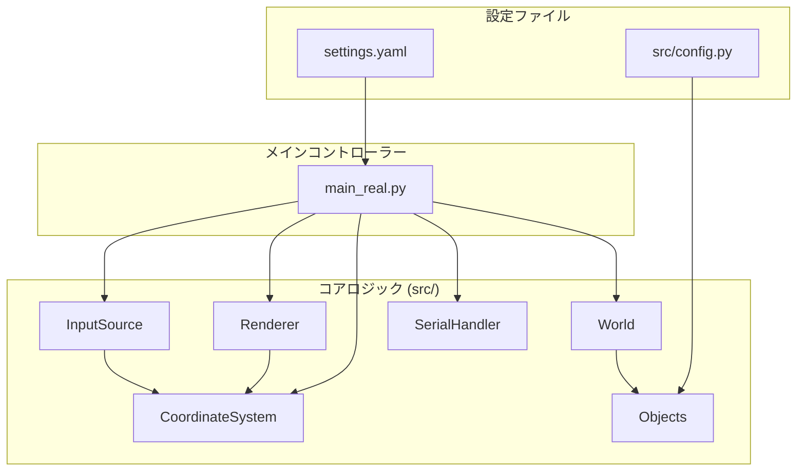

# 屈斜路の響き - インタラクティブ・ライトアート


*(▲ シミュレーターの実行画面。左が鳥の思考や位置を示すデバッグビュー、右が物理LEDでの見た目を忠実に再現したアーティスティックビュー)*

北海道・弟子屈町の自然をテーマにした、来場者参加型のインタラクティブアート作品のシミュレーション兼制御ソフトウェアです。来場者の動きを（最終的には）LiDARで検知し、その存在が「小鳥」として表現される光と音の群れに影響を与えます。

テクノロジーを通じて、**人と自然の、繊細で詩的な関わり合い**を体験してもらうことを目指します。

---

## デザイン哲学と技術的ハイライト

このプロジェクトは、単にLEDを光らせるだけではありません。「生命感とは何か？」という問いに対し、コードと物理的な制約を通して向き合った、私たちの探求の記録です。

### 1. こだわり：シミュレーションと現実の同期

メディアアート開発における最大の壁は、PC画面と物理的な展示物との「見た目のズレ」です。

> **問題:** 使用する12VのLEDテープは「3つのLEDが1ピクセル」という物理的制約があります。これを無視してシミュレーションを作ると、開発は手探りの当てずっぽうになります。

**解決策：シミュレーションを「物理に合わせる」**
ソフトウェアの全てのロジック（計算、描画、AI）を物理ピクセル単位で動作するように再設計しました。これにより、シミュレーターは**100%忠実なプレビュー**として機能し、PC画面で見たものが、そのまま物理世界で再現されます。

### 2. こだわり：光に「生命感」と「個性」を宿す

LEDは単なる点光源ですが、それを「生き物」として感じさせたかった。そのために、光の振る舞いに生物学的な解釈を加えました。

> **問題:** クマゲラのような「黒い鳥」をどう表現するか？複数の鳥の光が重なり、意図しない「混色」が起きるのをどう防ぐか？

**解決策：ハイブリッドAIと、光の「翻訳」**

1.  **色の翻訳:** クマゲラの「黒」を、完全な消灯ではなく`[35, 35, 50]`という**「限りなく黒に近い、深い濃紺」**として表現。存在感を失わないようにしました。
2.  **光のオーラ:** 光の端が滑らかに減衰するようにし、鋭い点ではなく柔らかなオーラのように見せています。
3.  **1D縄張り意識（ハイブリッドAI）:** 最大の工夫です。鳥のAIは2D空間を自由に動きながら、**LEDテープ上(1D)での他の鳥との距離**を監視します。もしテープ上で縄張りを侵犯されそうになると、AIは**2D空間上で相手を避ける**ように行動します。これにより、光のオーラが物理的に重なり合う前に互いに距離を取るため、不自然な混色が起こりません。

### 3. こだわり：アーティストの創造性を支える自動化

手作業には限界があり、創造性の足枷になります。反復作業をスクリプトに任せ、人間がより創造的な部分に集中できる環境を構築しました。

*   **音と光の共演 (`audio_sync_generator.py`):** 音声ファイルを解析し、そのリズムに完璧に同期した光の明滅パターンを**自動生成**します。
*   **作者の「筆跡」 (`artistic_path_generator.py`):** アーティストがマウスで描いた自由な曲線を、物理的な制約を満たすようにコンピュータが自動調整し、LEDの配置データとして保存します。

---

## 📂 アーキテクチャと役割分担

このプロジェクトは、各コンポーネントが明確な役割を持つ「関心の分離」の原則に基づいて設計されています。これにより、変更に強く、拡張しやすい構造を実現しています。

### システム依存関係



### 各ファイルの役割

*   `main.py` / `main_real.py`
    *   **役割**: **オーケストラの指揮者 (Conductor)**
    *   **説明**: 各コンポーネントを初期化し、メインループを回すことだけに専念します。シミュレーションの具体的な計算や描画方法については関知しません。`main_real.py`は、物理デバイス（Arduino）との通信も担当します。

*   `settings.yaml`
    *   **役割**: **マスター設定ファイル (Master Blueprint)**
    *   **説明**: 実行環境に依存する設定（シリアルポート、画面サイズ、登場する鳥の種類など）を記述します。ユーザーが**唯一、直接編集するべきファイル**です。

---

### `src/` ディレクトリ：システムの心臓部

*   `objects.py` (Bird, Human)
    *   **役割**: **役者 (Actors)**
    *   **説明**: 鳥や人間の「思考」や「個性」を定義します。彼らがどう行動し、何に反応するかのAIロジックがここに集約されています。

*   `simulation.py` (World)
    *   **役割**: **舞台 (The Stage)**
    *   **説明**: 全ての役者（オブジェクト）が存在する空間です。世界の物理法則（境界の外には出られない、など）を定め、役者たちの相互作用を管理します。

*   `renderer.py` (Renderer)
    *   **役割**: **画家 (The Painter)**
    *   **説明**: Worldの状態を受け取り、それを解釈してデバッグ画面とアーティスティック画面を描画する責務を負います。どう光らせるか、どう見せるか、という「表現」の部分を全て担当します。

*   `input_source.py` (MouseInputSource, UdpInputSource)
    *   **役割**: **感覚器官 (Sense Organs)**
    *   **説明**: マウスやLiDAR(UDP)からの入力を受け取り、シミュレーションで使える形式に変換します。`main`は入力がマウスなのかLiDARなのかを意識する必要がありません。

*   `serial_handler.py` (SerialWriterThread)
    *   **役割**: **現実への架け橋 (Bridge to Reality)**
    *   **説明**: <span style="color:red;">【今回の改善点】</span>Arduinoとのシリアル通信という、時間のかかる可能性のある処理を専門に担当します。バックグラウンドスレッドで動作するため、メインのシミュレーションループのパフォーマンスに一切影響を与えません。`main_real.py`がよりシンプルになりました。

*   `coordinates.py` (CoordinateSystem)
    *   **役割**: **物理法則の書 (The Book of Physics)**
    *   **説明**: <span style="color:red;">【今回の改善点】</span>シミュレーション空間（メートル単位）と表示空間（ピクセル単位）の間の座標変換ルールを**一元管理**します。`Renderer`（描画）と`InputSource`（入力）が同じ「物理法則」を参照することで、システム全体の座標の矛盾を防ぎます。

*   `config.py` / `config_structure.py`
    *   **役割**: **鳥のDNA (Bird DNA)**
    *   **説明**: `config_structure.py`は鳥の性格や色などの基本パラメータの原本です。`audio_sync_generator.py`スクリプトがこれを読み込み、音声解析結果と統合して、最終的な`config.py`を**自動生成**します。`config.py`は直接編集してはいけません。

---

## 🚀 使い方 (Setup & Usage)

#### ステップ1：環境のセットアップ
`requirements.txt`に記載されたライブラリをインストールします。
```bash
pip install -r requirements.txt
```

#### ステップ2：Arduinoの準備
1.  Arduino IDEのライブラリマネージャから**`FastLED`ライブラリ**をインストールします。
2.  `arduino/fastled.ino`を開き、`NUM_PHYSICAL_LEDS`や`DATA_PIN`をあなたのハードウェア構成に合わせて正しく設定します。
3.  スケッチをArduinoに書き込みます。

#### ステップ3：プロジェクト設定
1.  **`settings.yaml`** を開き、あなたの環境に合わせて`serial_port`（Arduinoの接続ポート）などを正しく設定します。
2.  ハードウェアテスト用にLEDの一部だけを使いたい場合は、`enable_test_mode`を`true`にし、`test_strip_led_count`に使用する物理LEDの数を設定します。

#### ステップ4：【最重要】実行前のビルド手順
このプロジェクトは、実行前に設定ファイルを「ビルド」するステップが必要です。

1.  **LEDレイアウトの生成 (初回 or デザイン変更時):**
    `scripts/artistic_path_generator.py`を実行し、画面の指示に従って対話的にLEDの配置をデザインし、保存します。
    ```bash
    python scripts/artistic_path_generator.py
    ```

2.  **設定ファイルのビルド (初回 or 鳥のパラメータ・音声変更時):**
    `scripts/audio_sync_generator.py`を実行します。これにより、`src/config_structure.py`と`assets/sounds/`が解析され、最新の**`src/config.py`が自動生成されます。**
    ```bash
    python scripts/audio_sync_generator.py
    ```

#### ステップ5：シミュレーションの実行
*   **シミュレーションのみで動きを確認する場合:**
    ```bash
    python main.py
    ```
*   **Arduinoに接続してLEDをリアルタイムで光らせる場合:**
    ```bash
    python main_real.py
    ```

---

## 🛠️ 主要技術スタック
- **Python 3.11+**
- **Pygame-ce:** シミュレーション描画と音声再生
- **NumPy:** 高速なベクトル・配列計算
- **Librosa:** 音声ファイルの解析とOnset検出
- **PyYAML, Matplotlib, PySerial:** ユーティリティ
- **Arduino / C++** with **FastLED:** 堅牢なLEDコントローラー

## 🔮 今後の展望
- [ ] LiDARセンサーとの接続を実装し、マウス操作を現実世界の人の動きに置き換える。
- [ ] 来場者がいない静かな時間帯の、鳥たちのより自然な環境インタラクションを実装する。